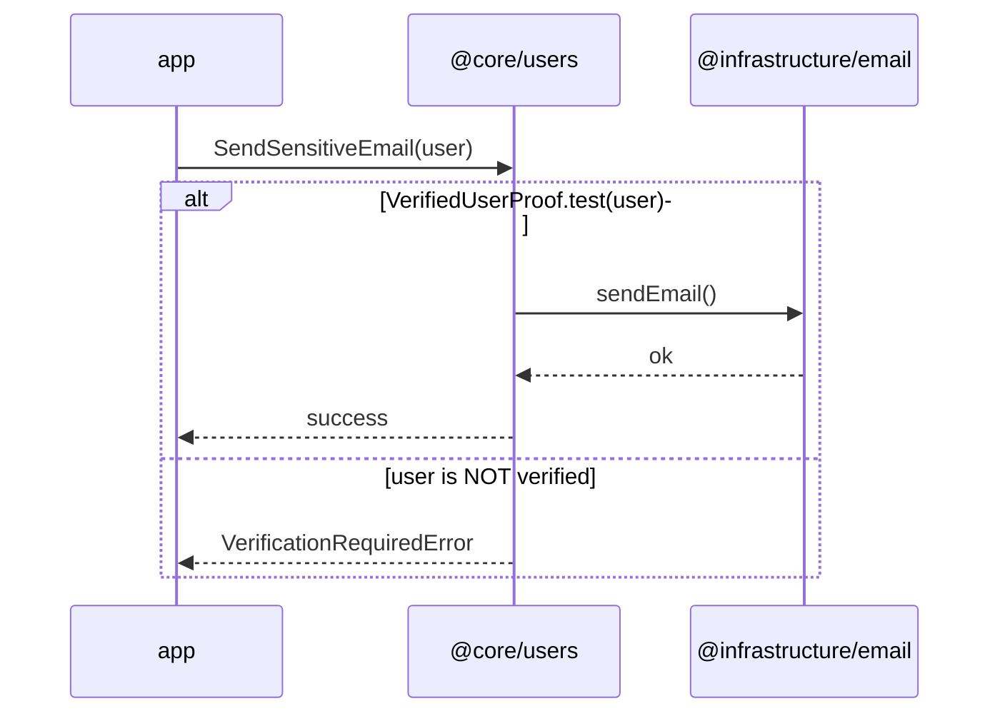
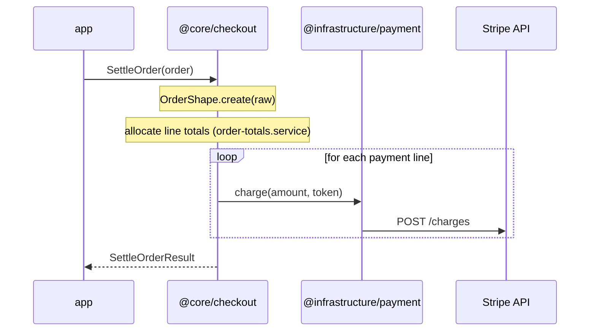

# Feature workflow (multi-layer)

## When to use

A user story touches **models**, **operations**, **use cases**, **ports**, **infrastructure**, and/or **composition**.

For a single artifact (only a shape, only ESLint), use the specialized skill instead—see router `clean-architecture-monorepo`.

Canonical architecture:

[architecture/clean-architecture-oriented-monorepo.md](../../../architecture/clean-architecture-oriented-monorepo.md)

---

## One phase per run (hard gate)

**Non-negotiable:** Phases 0–6 are **never** completed in a single agent run or a single user prompt.

| Rule                  | Meaning                                                                                                                  |
| --------------------- | ------------------------------------------------------------------------------------------------------------------------ |
| **One active phase**  | Work only the **current** phase (0, 1, 2, …). Do not start the next phase in the same run.                               |
| **Stop at phase end** | When the phase deliverable and its **Gate** are met, **stop**. Summarize what was done and what the next phase would be. |
| **Wait for the user** | Do not proceed until the user **confirms** the phase or asks for **corrections** (then stay in the same phase).          |
| **Serial order**      | Phases run **0 → 1 → 2 → 3 → 4 → 5 → 6** in order. No skipping ahead even if later work seems obvious.                   |

**Prohibited:**

- Implementing models, ports, infrastructure, and composition in one run because “the spec is clear.”
- Treating “implement the full feature” as permission to run every phase back-to-back.
- Continuing into the next phase because tests pass or the user did not say “stop”—**explicit confirmation is required** to advance.

**Allowed in one run:** work **within** the current phase only (e.g. multiple `specs/` files in Phase 1, or several shapes in Phase 2 if they belong to that phase’s scope).

**How to advance:** User confirms (e.g. “ok Phase 1”, “proceed to Phase 2”) or requests fixes in the current phase. A new user message starts the next phase; the agent still executes **only that phase** before stopping again.

---

## Phase 0 — Discovery

- [ ] Which `@core/<feature>` (or `pnpm generate core-feature`)? See skill `clean-monorepo-core-package-design`.
- [ ] List domain concepts → candidate `*.primitive.ts`, `*.shape.ts`, `*.proof.ts` files.
- [ ] **Proofs** that branch flows: kit name + how the `alt` will read (e.g. `UnlockedVaultProof.test(vault)`).
- [ ] **Capabilities** (if any): kit + **concrete method names**—never `validate`, `create`, or other kit-lifecycle names (see Phase 1 decision table).
- [ ] **Services** cross-model (if any): e.g. hash verify, totals.
- [ ] List external dependencies → candidate `*.port.ts` (names only; no SDK types).
- [ ] Acceptance criteria in **domain language**, not vendor APIs.

**Stop** if the task mixes unrelated bounded contexts—split into vertical slices first.

**Gate:** discovery summary agreed · **stop — wait for user before Phase 1**

---

## Phase 1 — Flow modelling (specs in repo)

**Before any models, ports, use cases, or infrastructure code**, model each vertical slice flow as a Mermaid `sequenceDiagram`. One diagram per user-facing flow (or per acceptance criterion when they differ).

### Deliverable (not volatile)

Phase 1 is **done** when flow diagrams (and any other planning diagrams agreed with the user—e.g. `flowchart`, `stateDiagram`) exist as **versioned source files** in the codebase. They are **not** chat-only or ephemeral previews.

### Where specs live (default: repo top-level)

**User-facing flows are not owned by a single `@core/*` package.** A sequence diagram models an **app story** that may invoke use cases from **one or several** core packages (e.g. `@core/checkout` then `@core/inventory`). Putting specs inside `packages/core-<feature>/` wrongly implies one bounded context per flow.

**Default location:** [`specs/`](../../../specs/) at the **monorepo root** (sibling of `apps/`, `packages/`, `architecture/`).

| Artifact                 | Path pattern                      | Notes                                                  |
| ------------------------ | --------------------------------- | ------------------------------------------------------ |
| Flow / sequence diagram  | `specs/<flow-kebab>.md`           | One file per user-facing flow (or per acceptance path) |
| Grouped flows (optional) | `specs/<journey-kebab>/<flow>.md` | User-journey folder—not a `@core/*` package name       |
| Other planning diagrams  | same tree, descriptive name       | Same format; only diagrams born from user planning     |

**Override (user-directed only):** `packages/core-<feature>/specs/` when the user **explicitly** scopes a diagram to a single bounded context and wants specs colocated with that package. Do **not** choose package-local specs by default for cross-package or ambiguous flows.

Do not create `models/`, `ports/`, or other implementation layers until Phase 2. Do not defer saving diagrams to “later in the PR.”

**File shape (minimal):** Markdown with a title (`# <Flow title>`), a short acceptance note in domain language, then a fenced `mermaid` block containing the diagram (e.g. `sequenceDiagram`).

Update these files when the agreed flow changes—treat them like source, not disposable sketches.

### Hard rule

**Do not write a single line of implementation code** (no Plop, no kits, no ports, no adapters) until the diagram is **clear and explicitly agreed** with the user **and** persisted under `specs/`. If the flow is ambiguous, refine the file(s) in `specs/` and ask—do not scaffold “to explore.”

### Participants (left → right)

| Order | Participant label             | Meaning                                                               |
| ----- | ----------------------------- | --------------------------------------------------------------------- |
| 1     | `app`                         | App entry point (route, handler, job, CLI)                            |
| 2+    | `@core/<feature>`             | **One lifeline per involved core package** (order: story / call flow) |
| next  | `@infrastructure/<name>`      | Infrastructure package implementing ports                             |
| last  | _(optional)_ external service | Vendor/API/DB/cache called only from infra                            |

Use concrete names: `@core/checkout`, `@core/inventory`, `@infrastructure/contentful`, `Contentful API`, `PostgreSQL`, `Redis`, etc. When a flow spans multiple cores, show **separate** `@core/*` lifelines—do not collapse unrelated bounded contexts into one.

### Message types

| From                  | To                    | Notation                            | Meaning                                                                                            |
| --------------------- | --------------------- | ----------------------------------- | -------------------------------------------------------------------------------------------------- |
| `app`                 | `@core/<feature>`     | Arrow, **use-case name**            | App invokes the use case                                                                           |
| `@core/<feature>`     | `@core/<feature>`     | Self-call (optional)                | Use case orchestrates domain (internal processing)                                                 |
| `@core/<feature>`     | _(same lifeline)_     | **`Note over core`**                | Models, capabilities, services touched in domain (not separate participants)                       |
| `@core/<feature>`     | `@core/<feature>`     | **`loop`**                          | **Only** when there is real iteration (e.g. over a collection)—not for ordinary domain steps       |
| `@core/<feature>`     | _(branching)_         | **`alt` / `else`**                  | **Proof checks** and other domain guards that change the flow path—the `alt` label names the check |
| `@core/<feature>`     | `@infrastructure/...` | Arrow, **port/adapter method name** | Core calls a port                                                                                  |
| `@infrastructure/...` | external service      | Arrow, **vendor operation**         | Infra delegates to the outside world                                                               |

Return arrows (`-->>`) are optional; use them when success/error responses matter for the flow.

**Domain inside core (default):**

- After `app` → `core`, use **`Note over core`** for kit **creation** (`XxxShape.create`, `XxxPrimitive.create`), **custom capability methods**, and **`*.service.ts`** (e.g. `Note over core: VaultEntryShape.create(input)`, `Note over core: VaultEntryCapabilities.redactSecret(entry)`, `Note over core: verify hash (vault.service)`).
- Use a **`core` → `core` self-call** only when you want to stress use-case → domain orchestration as a distinct step—not as a substitute for `loop`.
- Use **`loop`** only when the business flow truly repeats (N items, paginated fetch, retry batch, etc.).

### Specs notation — decision table

| Business rule                                                                                               | Artifact                                                  | In `sequenceDiagram`                                                                                                                                 |
| ----------------------------------------------------------------------------------------------------------- | --------------------------------------------------------- | ---------------------------------------------------------------------------------------------------------------------------------------------------- |
| Structure / field constraints at input boundary                                                             | `XxxShape.create` / `XxxPrimitive.create` (Zod in kit)    | `Note over core: VaultEntryShape.create(input)` inside the success branch                                                                            |
| **Additional guarantee** on already-valid data (state, authorization, semantic invariant—even on one field) | `*.proof.ts` (`refineType`; `test` / `assert` on kit API) | **`alt` / `else` label names the proof check**, e.g. `alt UnlockedVaultProof.test(vault)` — not a separate `Note` that duplicates the same branch    |
| Custom behavior beyond create/validation on one kit                                                         | `*.capabilities.ts`                                       | `Note over core: XxxCapabilities.<domainVerb>(…)` — **never** `validate` or `create` (kit lifecycle); use domain verbs (`rename`, `redactSecret`, …) |
| Rule across two+ kits (same feature)                                                                        | `*.service.ts`                                            | `Note over core: <description> (<name>.service)`                                                                                                     |
| Orchestration + I/O                                                                                         | `*.use-case.ts` + port                                    | `app→core` use-case name; `core→infra` port method                                                                                                   |

Skill detail: `clean-monorepo-core-models` (proofs), `clean-monorepo-core-capabilities` (forbidden capability names).

### Diagram anti-patterns (reject in Phase 1)

- **`Note over core: XxxProof.test`** immediately followed by **`alt vault is unlocked`** — the proof check must **be** the `alt` condition (e.g. `alt UnlockedVaultProof.test(vault)`), not a duplicate step.
- **`XxxCapabilities.validate`** / **`XxxCapabilities.create`** — creation and structural validation belong to shapes/primitives, not capabilities.
- Proof or capability as a **separate participant** in the diagram.
- Generic `alt` labels with no link to the guard when a **proof** is the domain gate (prefer `VerifiedUserProof.test(user)` over a vague `alt user is ok` unless the proof name adds no value).

**Proofs and branching:**

- When a **proof** gates the flow, the **`alt` condition is the proof check** (e.g. `alt UnlockedVaultProof.test(vault)` / `else vault is locked`).
- On the **success path that establishes** a proof, use a note with **`assert`** (e.g. `Note over core: UnlockedVaultProof.assert(vault)` after password match).
- Non-proof guards (e.g. password hash match via service) may use domain-language `alt` labels; still avoid a redundant note + `alt` for the same decision.

### Example (proof + port)



### Example (iteration + notes)



### Outcomes of this phase

From the saved `specs/` files you should know:

- [ ] Which **use cases** exist (labels on `app` → `core`).
- [ ] Which **models / capabilities / services** are involved (`Note over core`; real **`loop`** only if iterative).
- [ ] Which **proofs** branch the flow—the **`alt` label** names the check (e.g. `UnlockedVaultProof.test(vault)`), not a lone `Note` duplicating that branch.
- [ ] Which **ports** and **adapter methods** are needed (labels on `core` → `infra`).
- [ ] Which **infrastructure packages** and **external systems** are involved.
- [ ] Layer boundaries are valid (no `app` → infra, no external service called from core).
- [ ] Phase 1 **anti-patterns** checklist passed (no `Capabilities.validate`/`create`; no duplicate proof note + `alt`).

**Gate:** user agreement · **all** agreed diagrams committed under `specs/` (top-level by default) · no implementation code yet · **stop — wait for user before Phase 2**

---

## Phase 2 — Domain kits (`models/`)

Work in dependency order: **primitive → shape → proof**.

1. Scaffold kits: `pnpm generate primitive`, `pnpm generate shape`, `pnpm generate proof` as needed (skill `clean-monorepo-core-models`).
2. Fill Zod schemas, compose primitives into shapes, implement `refineType` on proofs.
3. Add colocated `models/*.test.ts` when validation or refinement is non-trivial.

**Gate:** `pnpm test:node` (model-layer tests) · `pnpm lint` · **stop — wait for user before Phase 3**

---

## Phase 3 — Operations (capabilities + services)

Work **before** use cases and infrastructure.

### Single-kit behavior → `*.capabilities.ts`

- `pnpm generate capabilities` after the shape or primitive kit exists; add `.attach` manually.
- Export `XxxCapabilities`; use `forShape` / `forPrimitive` (skill `clean-monorepo-core-capabilities`).
- Colocated `*.capabilities.test.ts` for non-trivial rules.

### Cross-model pure logic → `*.service.ts`

- Pure exported functions; no default DI (skill `clean-monorepo-core-services`).
- Colocated `*.service.test.ts`.

| Symptom                 | Wrong layer | Right layer               |
| ----------------------- | ----------- | ------------------------- |
| `verify(user)`          | use case    | `user.capabilities.ts`    |
| `total(cart, taxRules)` | use case    | `order-totals.service.ts` |
| `charge(card, gateway)` | service     | use case + `PaymentPort`  |

**Gate:** domain tests green · no `ports/` or infrastructure imports in `models/` or `operations/` · **stop — wait for user before Phase 4**

---

## Phase 4 — Application (ports + use cases)

Names and responsibilities must match **Phase 1** `specs/` diagrams (use-case labels, port method labels).

1. Define **small, role-oriented** `*.port.ts` interfaces driven by use-case needs—domain types only, no framework/SDK types.
2. Implement `*.use-case.ts` orchestration: capabilities, services, then ports.
3. `pnpm generate use-case` scaffolds `*.use-case.test.ts`—replace stub with **fake port** implementations (manual stubs or test doubles).
4. **Never** call real adapters, HTTP, DB, or CMS from core tests.

Use `remeda` `pipe` in use cases when chaining capability steps (skill `clean-monorepo-core-capabilities`).

**Gate:** use-case unit tests green · ports free of infrastructure types · `pnpm lint` · **stop — wait for user before Phase 5**

---

## Phase 5 — Infrastructure

After core contracts are stable:

```txt
packages/infrastructure-<name>/
  client/       # SDK setup (reusable)
  mappers/      # raw → domain / port DTOs — unit test here
  adapters/     # implements @core/*/ports
```

- Adapters are thin: map, delegate to client, map back.
- Adapter method names should match the **Phase 1** `specs/` `core` → `infra` labels.
- No application orchestration in infrastructure.
- Unit-test mappers (`raw` → domain kits / port shapes) without hitting live APIs when possible.

**Gate:** mapper tests · adapters implement ports without leaking SDK types into `@core/*` · **stop — wait for user before Phase 6**

---

## Phase 6 — Composition (and app UI)

Follow skill **`clean-monorepo-composition-root`** (mandatory).

1. **New** composition module → `pnpm generate composition-root` only (never hand-roll the provider skeleton).
2. Wire app-scoped deps on the provider; request-scoped deps via `getForContext(ctx)`.
3. Export `getXxxRoot(ctx)` that passes infrastructure into `createXUseCase({ ...ports })` only—capabilities stay in `operations/`.
4. **No new business rules** in composition—only wiring and framework setup.
5. App/UI calls `getXxxRoot` (or thin wrappers)—not `@infrastructure/*` directly.

**Gate:** `pnpm lint` · `pnpm test:node` (full workspace) · targeted app tests if applicable · **stop — feature slice complete; wait for user sign-off**

---

## Hard stops (non-negotiable)

**Stop and ask / split the task** if you see:

- **Multiple phases executed in one agent run** or one prompt (see [One phase per run](#one-phase-per-run-hard-gate))—revert scope to the current phase only and wait for user checkpoint.
- Flow diagrams only in chat/notes—**not** saved under top-level `specs/` (or user-directed package `specs/`).
- Implementation started **before** agreed Phase 1 specs exist in the repo.
- `@core/*` importing `@infrastructure/*`, `@ui/*`, React, Next, or SDK packages.
- Port interfaces exposing vendor types (`ContentfulEntry`, `Stripe.Charge`, etc.).
- Domain invariants only in adapters or React components.
- Use-case tests requiring real network/DB/CMS.
- Two `@core/*` features importing each other without an explicit integration design.

**Never** relax workspace tooling to bypass a violation (`eslint.config.js`, `tsconfig*.json`, Prettier, Vitest, path aliases, boundary rules). Exception: adding a new framework name to the core ban list—skill `clean-monorepo-boundaries`—only with user awareness.

**Never** add a new `apps/*/composition/*.ts` without `pnpm generate composition-root`.

If tooling or composition structure must change, **stop**, explain necessity to the user, and wait for approval—do not edit config to ship faster.

An architecture-violating “shortcut” is **not** acceptable—re-scope from Phase 0 (or redraw Phase 1).

---

## Skill map (by phase)

| Phase | Skills                                                             |
| ----- | ------------------------------------------------------------------ |
| 0     | `clean-monorepo-core-package-design`                               |
| 1     | _(this skill — `specs/` flow diagrams in repo; user agreement)_    |
| 2     | `clean-monorepo-core-models`, `clean-monorepo-plop`                |
| 3     | `clean-monorepo-core-capabilities`, `clean-monorepo-core-services` |
| 4     | `clean-monorepo-plop` (port, use-case)                             |
| 5–6   | `clean-monorepo-boundaries`, `clean-monorepo-composition-root`     |

Router: `clean-architecture-monorepo`.
