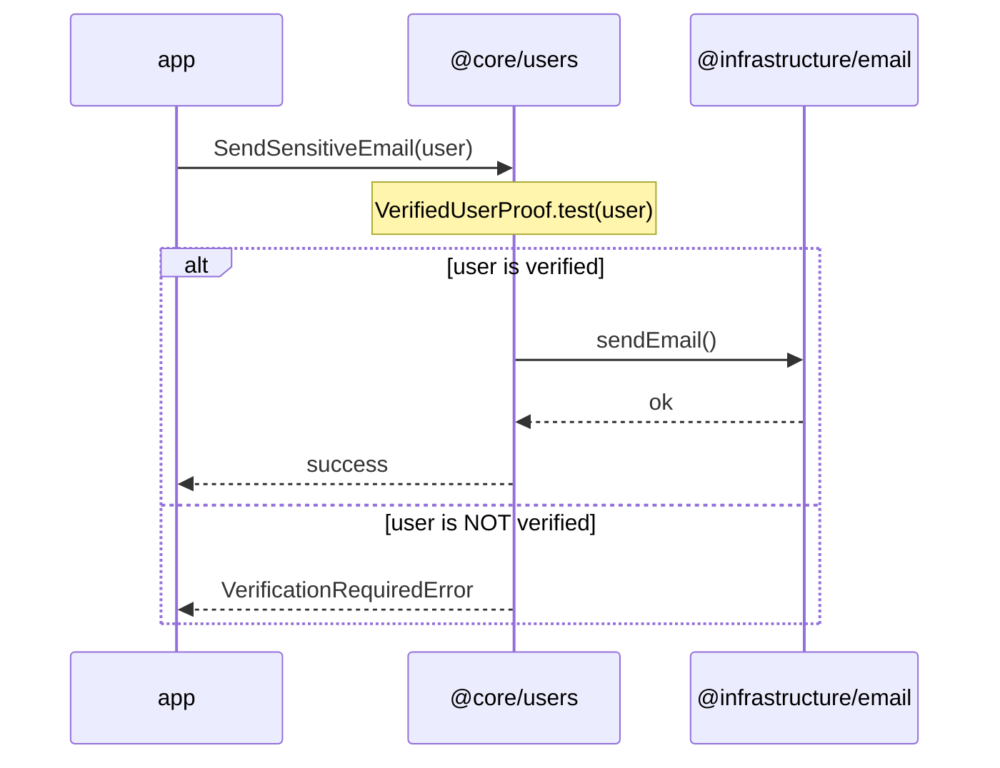

# Feature workflow (multi-layer)

## When to use

A user story touches **models**, **operations**, **use cases**, **ports**, **infrastructure**, and/or **composition**.

For a single artifact (only a shape, only ESLint), use the specialized skill instead—see router `clean-architecture-monorepo`.

Canonical architecture:

[architecture/clean-architecture-oriented-monorepo.md](../../../architecture/clean-architecture-oriented-monorepo.md)

---

## One phase per run (hard gate)

**Non-negotiable:** Phases 1–6 are **never** completed in a single agent run or a single user prompt.

| Rule                  | Meaning                                                                                                                  |
| --------------------- | ------------------------------------------------------------------------------------------------------------------------ |
| **One active phase**  | Work only the **current** phase (1, 2, …). Do not start the next phase in the same run.                                  |
| **Stop at phase end** | When the phase deliverable and its **Gate** are met, **stop**. Summarize what was done and what the next phase would be. |
| **Wait for the user** | Do not proceed until the user **confirms** the phase or asks for **corrections** (then stay in the same phase).          |
| **Serial order**      | Phases run **1 → 2 → 3 → 4 → 5 → 6** in order. No skipping ahead even if later work seems obvious.                       |

**Prohibited:**

- Implementing models, ports, infrastructure, and composition in one run because “the spec is clear.”
- Treating “implement the full feature” as permission to run every phase back-to-back.
- Continuing into the next phase because tests pass or the user did not say “stop”—**explicit confirmation is required** to advance.

**Allowed in one run:** work **within** the current phase only (e.g. iterating on `SPEC.md` and `DESIGN.md` in Phase 1, or several shapes in Phase 2 if they belong to that phase’s scope).

**How to advance:** User confirms (e.g. “ok Phase 1”, “proceed to Phase 2”) or requests fixes in the current phase. A new user message starts the next phase; the agent still executes **only that phase** before stopping again.

---

## Phase 1 — Specs

**Before any models, ports, use cases, or infrastructure code**, capture the feature as versioned spec documents under a dedicated folder.

### Deliverable (not volatile)

Phase 1 is **done** when **`SPEC.md`** and **`DESIGN.md`** exist, are agreed with the user, and are persisted in the repo. They are **not** chat-only or ephemeral drafts.

### Where specs live

Create (or reuse) a folder per feature slice:

```txt
specs/<spec-name>/
  SPEC.md
  DESIGN.md
```

- **Location:** top-level [`specs/`](../../../specs/) at the monorepo root (sibling of `apps/`, `packages/`, `architecture/`).
- **`<spec-name>`:** kebab-case, business-oriented (e.g. `password-vault-unlock`, `page-path-resolution`)—not necessarily identical to a `@core/*` package name.
- **One folder per vertical slice.** Split unrelated bounded contexts into separate `specs/<spec-name>/` folders before implementation.

Do not create `models/`, `ports/`, or other implementation layers until Phase 1 is complete. Do not defer saving specs to “later in the PR.”

### Hard rule

**Do not write a single line of implementation code** (no Plop, no kits, no ports, no adapters) until **`SPEC.md`** and **`DESIGN.md`** are **clear, domain-aligned, explicitly agreed** with the user, and saved under `specs/<spec-name>/`. If either document is ambiguous or vendor-tainted, refine it and ask—do not scaffold “to explore.”

---

### `SPEC.md` — functional requirement (domain language)

Describes **what** the feature does at a high level, in **domain language** only.

**Must include:**

- Feature purpose and scope in business/domain terms.
- User-facing flows or acceptance criteria (what succeeds, what fails, in domain terms).
- Constraints and invariants the business cares about—not how they are stored or fetched.

**Must NOT include:**

- Vendor or product names (Contentful, Stripe, PostgreSQL, Redis, …).
- SDK/API/DB terminology (`sys.id`, `fetch`, `POST /charges`, ORM, cache keys, …).
- Infrastructure choices (which CMS, which payment gateway, which database).
- References to existing code gaps (“we don’t have X yet”, “add a new shape because …”).

**Vendor input → stop and translate:**

If the user provides low-level or vendor-specific wording and an immediate domain rewrite is **not** obvious, **stop** and iterate on `SPEC.md` with the user before writing `DESIGN.md`.

| User input (wrong)                                                                                 | Domain rewrite (right)                                                                           |
| -------------------------------------------------------------------------------------------------- | ------------------------------------------------------------------------------------------------ |
| “Fetch from Contentful the `treeContent` entry and pages for a list of `sys.id`, to compute paths” | “Resolve page paths from CMS content via a tree path-resolution algorithm over page identifiers” |
| “Save to PostgreSQL with a JSONB column”                                                           | “Persist vault entries durably; entries survive restarts”                                        |
| “Call Stripe POST /charges for each line”                                                          | “Settle each payment line against the payment provider”                                          |

Until `SPEC.md` is **technology-agnostic**, Phase 1 is **not** complete—keep iterating on this file.

**Writing style — to-be, not delta:**

Write as a **target definition**, not a migration checklist.

| Wrong (delta)                                           | Right (to-be)                                                                |
| ------------------------------------------------------- | ---------------------------------------------------------------------------- |
| “We need to add `VaultEntryShape` because it’s missing” | “A vault entry comprises label, username, secret, and optional notes”        |
| “Create a new port for Contentful”                      | “Page path resolution requires a content source that supplies the page tree” |

---

### `DESIGN.md` — architecture mapping

Maps the functional requirement from `SPEC.md` onto the clean-architecture layers. This is the **blueprint** for Phases 2–6.

**Must include (in domain language except the adapters section):**

| Section             | Content                                                                                                                      |
| ------------------- | ---------------------------------------------------------------------------------------------------------------------------- |
| **Core package(s)** | Which `@core/<feature>` package(s) own the slice; see skill `clean-monorepo-core-package-design` if a new package is needed. |
| **Domain models**   | Required `*.primitive.ts`, `*.shape.ts`, `*.proof.ts` kits and what each represents.                                         |
| **Capabilities**    | Per-kit custom methods (`XxxCapabilities.<domainVerb>`)—**never** `validate`, `create`, or other kit-lifecycle names.        |
| **Services**        | Cross-model pure logic in `*.service.ts` (if any).                                                                           |
| **Use cases**       | Named orchestrators the app invokes (e.g. `UnlockVault`, `ListVaultEntries`).                                                |
| **Ports**           | Role-oriented `*.port.ts` interfaces—domain types only, method names driven by use-case needs.                               |
| **Adapters**        | `@infrastructure/<name>` packages, external systems, and mapping concerns—**vendor/SDK terms allowed only here**.            |

Optional but encouraged: **Mermaid `sequenceDiagram`** per user-facing flow when orchestration or proof branching is non-obvious. Diagram rules below apply only inside `DESIGN.md` (not in `SPEC.md`).

**Writing style — to-be, not delta:**

| Wrong (delta)                              | Right (to-be)                                                                    |
| ------------------------------------------ | -------------------------------------------------------------------------------- |
| “Add `UnlockedVaultProof` to gate listing” | “Listing entries requires an unlocked vault (`UnlockedVaultProof` gates access)” |
| “We will create `VaultRepositoryPort`”     | “Vault persistence is accessed through `VaultRepositoryPort`”                    |

**Artifact decision table** (use when mapping business rules from `SPEC.md`):

| Business rule                                                                                               | Artifact                                                  |
| ----------------------------------------------------------------------------------------------------------- | --------------------------------------------------------- |
| Structure / field constraints at input boundary                                                             | `XxxShape.create` / `XxxPrimitive.create` (Zod in kit)    |
| **Additional guarantee** on already-valid data (state, authorization, semantic invariant—even on one field) | `*.proof.ts` (`refineType`; `test` / `assert` on kit API) |
| Custom behavior beyond create/validation on one kit                                                         | `*.capabilities.ts` — domain verbs only                   |
| Rule across two+ kits (same feature)                                                                        | `*.service.ts`                                            |
| Orchestration + I/O                                                                                         | `*.use-case.ts` + port                                    |
| External system access                                                                                      | `*.port.ts` + `@infrastructure/*` adapter                 |

Skill detail: `clean-monorepo-core-models` (proofs), `clean-monorepo-core-capabilities` (forbidden capability names).

**Stop** if the task mixes unrelated bounded contexts—split into separate `specs/<spec-name>/` folders first.

---

### Optional flow diagrams (inside `DESIGN.md` only)

When a flow helps clarify use-case orchestration, add a fenced `mermaid` block per user-facing path.

**Participants (left → right):**

| Order | Participant label             | Meaning                                                               |
| ----- | ----------------------------- | --------------------------------------------------------------------- |
| 1     | `app`                         | App entry point (route, handler, job, CLI)                            |
| 2+    | `@core/<feature>`             | **One lifeline per involved core package** (order: story / call flow) |
| next  | `@infrastructure/<name>`      | Infrastructure package implementing ports                             |
| last  | _(optional)_ external service | Vendor/API/DB/cache called only from infra                            |

**Message types:**

| From                  | To                    | Notation                            | Meaning                                                                                                                                                              |
| --------------------- | --------------------- | ----------------------------------- | -------------------------------------------------------------------------------------------------------------------------------------------------------------------- |
| `app`                 | `@core/<feature>`     | Arrow, **use-case name**            | App invokes the use case                                                                                                                                             |
| `@core/<feature>`     | _(same lifeline)_     | **`Note over core`**                | Models, capabilities, services touched in domain (not separate participants)                                                                                         |
| `@core/<feature>`     | _(branching)_         | **`Note` + `alt` / `else`**         | **Proof gates:** `Note over core: XxxProof.test(…)` then **`alt`** with a **short** domain label (e.g. `alt user is verified`); non-proof guards may use `alt` alone |
| `@core/<feature>`     | `@infrastructure/...` | Arrow, **port/adapter method name** | Core calls a port                                                                                                                                                    |
| `@infrastructure/...` | external service      | Arrow, **vendor operation**         | Infra delegates to the outside world (vendor terms OK here)                                                                                                          |

**Proof gates in diagrams (preferred notation):**

Mermaid wraps long `alt` labels badly. When a **proof** branches the flow:

1. **`Note over core: XxxProof.test(…)`** — exact proof API (readable even if the note wraps).
2. **`alt` / `else`** with **short domain-language** labels (e.g. `alt user is verified` / `else user is NOT verified`)—not the full `XxxProof.test(...)` string in `alt`.

**Diagram anti-patterns:**

- **`alt UnlockedVaultProof.test(vault)`** (or similar long proof expression **only** in `alt`) — prefer **Note + short `alt`** (see example below).
- **Proof-gated branch** with a vague **`alt`** (e.g. `alt ok`) and **no** preceding **`Note over core: XxxProof.test(…)`** — the proof API must appear on the note.
- **`XxxCapabilities.validate`** / **`XxxCapabilities.create`** — creation and structural validation belong to shapes/primitives.
- Proof or capability as a **separate participant** in the diagram.

**Example (proof + port):**



---

### Outcomes of Phase 1

From `specs/<spec-name>/SPEC.md` and `DESIGN.md` you should know:

- [ ] **What** the feature does (`SPEC.md`)—domain language, no vendor leakage.
- [ ] **Which `@core/*` packages** and **domain kits** are required (`DESIGN.md`).
- [ ] **Which proofs** branch flows—in `DESIGN.md` prose and, in diagrams, `Note over core: XxxProof.test(…)` plus short `alt` / `else` labels.
- [ ] **Which capabilities and services** implement single-kit and cross-model rules.
- [ ] **Which use cases, ports, and adapters** exist—names stable for Phases 4–5.
- [ ] Layer boundaries are valid (no `app` → infra; no external service called from core).
- [ ] Both files use **to-be** language, not delta/procedural wording.

**Gate:** user agreement · `specs/<spec-name>/SPEC.md` and `DESIGN.md` saved · no implementation code yet · **stop — wait for user before Phase 2**

---

## Phase 2 — Domain kits (`models/`)

Implement the **Domain models** section of `DESIGN.md`.

Work in dependency order: **primitive → shape → proof**.

1. Scaffold kits: `pnpm generate primitive`, `pnpm generate shape`, `pnpm generate proof` as needed (skill `clean-monorepo-core-models`).
2. Fill Zod schemas, compose primitives into shapes, implement `refineType` on proofs.
3. Add colocated `models/*.test.ts` when validation or refinement is non-trivial.

**Gate:** `pnpm test:node` (model-layer tests) · `pnpm lint` · **stop — wait for user before Phase 3**

---

## Phase 3 — Operations (capabilities + services)

Implement the **Capabilities** and **Services** sections of `DESIGN.md`.

Work **before** use cases and infrastructure.

### Single-kit behavior → `*.capabilities.ts`

- `pnpm generate capabilities` after the shape or primitive kit exists; add `.attach` manually.
- Export `XxxCapabilities`; use `forShape` / `forPrimitive` (skill `clean-monorepo-core-capabilities`).
- Colocated `*.capabilities.test.ts` for non-trivial rules.

### Cross-model pure logic → `*.service.ts`

- Pure exported functions; no default DI (skill `clean-monorepo-core-services`).
- Colocated `*.service.test.ts`.

| Symptom                 | Wrong layer | Right layer               |
| ----------------------- | ----------- | ------------------------- |
| `verify(user)`          | use case    | `user.capabilities.ts`    |
| `total(cart, taxRules)` | use case    | `order-totals.service.ts` |
| `charge(card, gateway)` | service     | use case + `PaymentPort`  |

**Gate:** domain tests green · no `ports/` or infrastructure imports in `models/` or `operations/` · **stop — wait for user before Phase 4**

---

## Phase 4 — Application (ports + use cases)

Implement the **Use cases** and **Ports** sections of `DESIGN.md`.

Names and responsibilities must match `DESIGN.md` (and any sequence diagrams therein).

1. Define **small, role-oriented** `*.port.ts` interfaces driven by use-case needs—domain types only, no framework/SDK types.
2. Implement `*.use-case.ts` orchestration: capabilities, services, then ports.
3. `pnpm generate use-case` scaffolds `*.use-case.test.ts`—replace stub with **fake port** implementations (manual stubs or test doubles).
4. **Never** call real adapters, HTTP, DB, or CMS from core tests.

Use `remeda` `pipe` in use cases when chaining capability steps (skill `clean-monorepo-core-capabilities`).

**Gate:** use-case unit tests green · ports free of infrastructure types · `pnpm lint` · **stop — wait for user before Phase 5**

---

## Phase 5 — Infrastructure

Implement the **Adapters** section of `DESIGN.md`.

After core contracts are stable:

```txt
packages/infrastructure-<name>/
  client/       # SDK setup (reusable)
  mappers/      # raw → domain / port DTOs — unit test here
  adapters/     # implements @core/*/ports
```

- Adapters are thin: map, delegate to client, map back.
- Adapter method names should match `DESIGN.md` (and any diagram `core` → `infra` labels).
- No application orchestration in infrastructure.
- Unit-test mappers (`raw` → domain kits / port shapes) without hitting live APIs when possible.

**Gate:** mapper tests · adapters implement ports without leaking SDK types into `@core/*` · **stop — wait for user before Phase 6**

---

## Phase 6 — Composition (and app UI)

Wire the feature into the app after Phases 2–5 are stable.

Follow skill **`clean-monorepo-composition-root`** (mandatory).

1. **New** composition module → `pnpm generate composition-root` only (never hand-roll the provider skeleton).
2. Wire app-scoped deps on the provider; request-scoped deps via `getForContext(ctx)`.
3. Export `getXxxRoot(ctx)` that passes infrastructure into `createXUseCase({ ...ports })` only—capabilities stay in `operations/`.
4. **No new business rules** in composition—only wiring and framework setup.
5. App/UI calls `getXxxRoot` (or thin wrappers)—not `@infrastructure/*` directly.

**Gate:** `pnpm lint` · `pnpm test:node` (full workspace) · targeted app tests if applicable · **stop — feature slice complete; wait for user sign-off**

---

## Hard stops (non-negotiable)

**Stop and ask / split the task** if you see:

- **Multiple phases executed in one agent run** or one prompt (see [One phase per run](#one-phase-per-run-hard-gate))—revert scope to the current phase only and wait for user checkpoint.
- Specs only in chat/notes—**not** saved under `specs/<spec-name>/`.
- `SPEC.md` containing vendor or infrastructure terminology that has not been rewritten to domain language.
- Implementation started **before** agreed `SPEC.md` and `DESIGN.md` exist in the repo.
- `@core/*` importing `@infrastructure/*`, `@ui/*`, React, Next, or SDK packages.
- Port interfaces exposing vendor types (`ContentfulEntry`, `Stripe.Charge`, etc.).
- Domain invariants only in adapters or React components.
- Use-case tests requiring real network/DB/CMS.
- Two `@core/*` features importing each other without an explicit integration design.

**Never** relax workspace tooling to bypass a violation (`eslint.config.js`, `tsconfig*.json`, Prettier, Vitest, path aliases, boundary rules). Exception: adding a new framework name to the core ban list—skill `clean-monorepo-boundaries`—only with user awareness.

**Never** add a new `apps/*/composition/*.ts` without `pnpm generate composition-root`.

If tooling or composition structure must change, **stop**, explain necessity to the user, and wait for approval—do not edit config to ship faster.

An architecture-violating “shortcut” is **not** acceptable—re-scope from Phase 1 (iterate `SPEC.md` / `DESIGN.md`).

---

## Skill map (by phase)

| Phase | Skills                                                                         |
| ----- | ------------------------------------------------------------------------------ |
| 1     | `clean-monorepo-core-package-design`, _(this skill — `SPEC.md` + `DESIGN.md`)_ |
| 2     | `clean-monorepo-core-models`, `clean-monorepo-plop`                            |
| 3     | `clean-monorepo-core-capabilities`, `clean-monorepo-core-services`             |
| 4     | `clean-monorepo-plop` (port, use-case)                                         |
| 5–6   | `clean-monorepo-boundaries`, `clean-monorepo-composition-root`                 |

Router: `clean-architecture-monorepo`.
